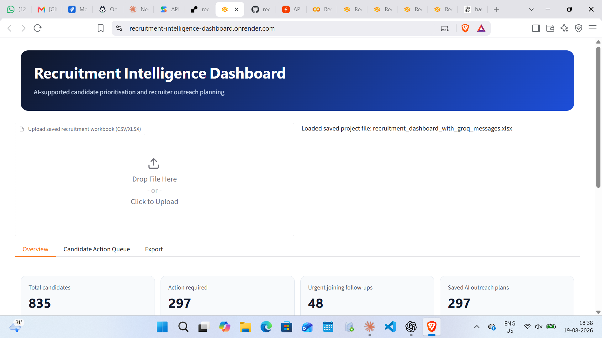
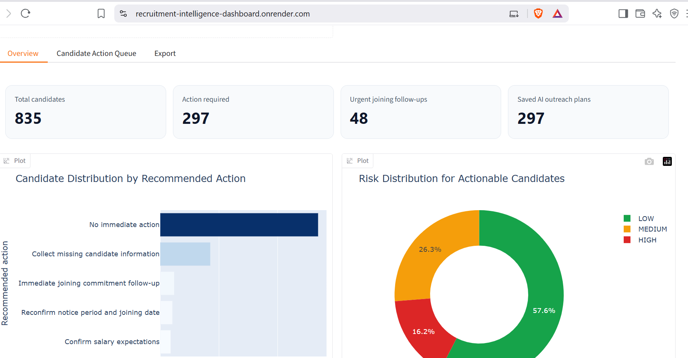
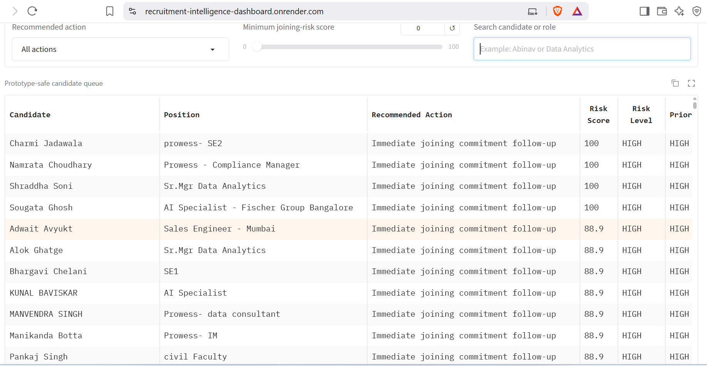
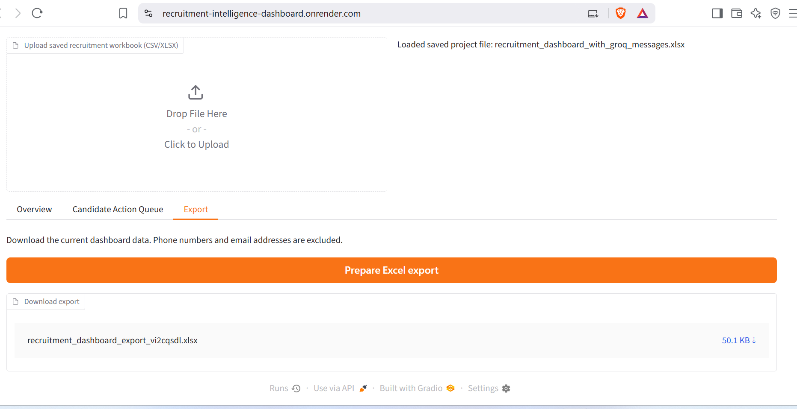

# 🎯 Recruitment Follow-up & Offer-to-Joining Intelligence System

### *"Which candidate should I call today — and why?"*

An AI-supported dashboard that tells recruiters exactly which candidates need attention, how likely they are to actually join after accepting an offer, and what to say to them — automatically.

🔗 **Live App:** [recruitment-intelligence-dashboard.onrender.com](https://recruitment-intelligence-dashboard.onrender.com)
💻 **Code:** [github.com/Priya2523/recruitment-intelligence-dashboard](https://github.com/Priya2523/recruitment-intelligence-dashboard)

---

## 📌 Table of Contents

1. [The Problem](#-the-problem)
2. [Why I Built This](#-why-i-built-this)
3. [The Solution](#-the-solution)
4. [How It Works (Architecture)](#-how-it-works-architecture)
5. [Screenshots](#-screenshots)
6. [The Intelligence Layer — Explained Simply](#-the-intelligence-layer--explained-simply)
7. [What I Actually Did (Step by Step)](#-what-i-actually-did-step-by-step)
8. [Tech Stack](#-tech-stack)
9. [Data Privacy](#-data-privacy)
10. [Project Structure](#-project-structure)
11. [Limitations & What's Next](#-limitations--whats-next)
12. [About This Project](#-about-this-project)

---

## 🧩 The Problem

Small and mid-sized recruitment teams juggle hundreds of candidates across dozens of open roles at the same time. In practice, this creates four recurring headaches:

1. **No one knows who to follow up with today.** Recruiters rely on memory or scattered Excel sheets to decide who to call next.
2. **Offered candidates silently drop off.** A candidate accepts an offer, goes quiet, and doesn't show up on their joining date — with no early warning.
3. **No one can explain *why* a candidate is risky.** Even when someone senses a candidate might not join, there's no consistent, defensible reason to point to.
4. **No clear next action.** Even after spotting a problem, recruiters don't have a ready-made message or task to act on immediately.

In short: **recruiters have data, but not intelligence.**

## 💡 Why I Built This

This project is a direct continuation of my earlier [Recruitment Analytics Dashboard](https://github.com/Priya2523/recruitment-analytics-platform), which analyzed *past* recruiter activity (who searched for what, when, and how).

That dashboard answered "**what already happened**." This one answers "**what should happen next**."

The existing 835-candidate dataset (from clients like Prowess, Lodha, Fischer, Hilti & Alumil, and L&T) is rich in recruiter activity data — but it was never designed to track the *offer-to-joining* journey. Rather than inventing a disconnected, fake dataset, I chose a more realistic approach: **reuse the real recruitment data as the foundation, and layer a lifecycle-tracking and risk-intelligence system on top of it** — the same way a real product would evolve.

## 🛠️ The Solution

A system that automatically:

| # | What it answers | How |
|---|---|---|
| 1 | *Which candidates need follow-up today?* | A **Follow-up Priority Engine** scores every candidate on urgency |
| 2 | *Which offered candidates are at risk of not joining?* | A **Joining-Risk Engine** scores every candidate 0–100 on the chance they don't show up |
| 3 | *Why is this candidate high risk?* | Every score comes with the **exact reasons** (salary gap, long notice period, silence, etc.) |
| 4 | *What should the recruiter do about it?* | An **AI layer (Groq/Llama)** writes a plain-English recruiter task and a ready-to-send WhatsApp message |

The output is designed to read like a briefing, not a spreadsheet:

> **Candidate:** C1024 · **Joining Risk: 78% — HIGH**
> **Key signals:** Expected ₹8.5L vs Offered ₹7.5L · 60-day notice period · No response in 6 days · Joining in 18 days
> **AI explanation:** Candidate shows elevated joining risk due to a salary gap, long notice period, and declining communication.
> **Recommended action:** Contact today and reconfirm joining commitment. Discuss compensation concerns if applicable.

Every risk score, follow-up priority, and recommended action shown in the dashboard is generated this same way.

## 🏗️ How It Works (Architecture)

In plain terms: raw, messy recruiter spreadsheets go in one end, and a prioritized, explained, ready-to-act call list comes out the other end.

                 Existing Recruitment Data 
                                │
                                ▼
                ┌───────────────────────────────┐
                │   Data Cleaning & Repair       │
                │  (fix shifted columns, remove  │
                │   duplicates, mask contact info)│
                └───────────────┬───────────────┘
                                ▼
                 Candidate Lifecycle Dataset
                (adds stage, offer, follow-up,
                    and joining information)
                                │
            ┌───────────────────┴───────────────────┐
            ▼                                        ▼
┌───────────────────────┐                ┌───────────────────────┐
│   Follow-up Engine     │                │     Risk Engine        │
│  "Who needs action?"   │                │ "Who may not join?"    │
└───────────┬────────────┘                └────────────┬───────────┘
            │                                            │
            └───────────────────┬────────────────────────┘
                                 ▼
                      Groq LLM (Llama-based model)
                                 │
                                 ▼
                Plain-English Explanation + Recommended Action
                                 │
                                 ▼
                      Recruiter Dashboard (Gradio)
                        hosted on Render.com

                        
**Why this order matters:** the rule-based scoring (Follow-up Engine + Risk Engine) runs *first*, using transparent, explainable logic — not a black box. Only *after* a candidate is flagged does the AI step in, purely to translate the numbers into a clear explanation and message. This keeps every decision auditable: a recruiter can always see the raw signals behind an AI recommendation.

##

**1. Home screen — load a saved workbook or upload a fresh one**

**2. Overview tab — at-a-glance KPIs and risk distribution**

**3. Candidate Action Queue — every candidate, ranked by urgency, with filters**

**4. Export tab — download a PII-safe report for the team**

## 🧠 The Intelligence Layer — Explained Simply

### Follow-up Priority (🟢 Normal → 🔴 Urgent)

Think of this as a "how soon should I call this person" score. It goes up when:
- It's been a while since the recruiter last spoke to the candidate
- The candidate is at a sensitive stage (e.g., interview scheduled, offer pending)
- There's a pending action nobody has completed yet
- The candidate hasn't responded recently
- Their joining date is getting close

### Joining-Risk Score (0–100, Low / Medium / High)

Think of this as "how likely is this candidate to disappear before their first day." It goes up when:
- There's a **gap between what they expect and what they were offered**
- Their **notice period is long** (more time = more chance of a counter-offer or change of heart)
- They've **gone quiet** after previously responding
- Their **joining date is approaching without confirmation**
- **Relocation** is involved and unconfirmed

Both scores are calculated with **plain arithmetic (rule-based logic)**, not a hidden AI model — so every score can be explained and defended. The AI (Groq/Llama) is only used *afterward*, to turn the score and its reasons into a natural-language explanation and a ready-to-send message. This was a deliberate design choice: recruiters need to trust *why* a candidate was flagged, not just accept a number.

## 🪜 What I Actually Did (Step by Step)

| Phase | What I did |
|---|---|

| **1. Problem + Data** | Defined exactly what a recruiter needs to know day-to-day, and audited what the existing dataset could and couldn't answer |
| **2. Dataset** | Extended the existing 835-candidate recruitment dataset into a full candidate lifecycle dataset (stage, offer date, follow-ups, joining date, response status, etc.), extensively cleaning shifted/misplaced columns (salary values sitting in notice-period fields, locations sitting in experience fields, and similar spreadsheet errors) row by row |
| **3. Rule-based intelligence** | Built the Follow-up Priority Engine first, using only transparent point-based rules — no AI involved yet |
| **4. Risk model** | Built the Joining-Risk Engine the same way, so every risk score has a clear, auditable reason |
| **5. Groq AI layer** | Connected the Groq API (Llama-family model) to turn each flagged candidate's data into a plain-English explanation, a recruiter task, and a WhatsApp-ready outreach message |
| **6. UI** | Built the recruiter dashboard in Gradio — an Overview tab (KPIs + charts), a Candidate Action Queue (filterable, searchable table), and an Export tab |
| **7. Testing** | Deliberately created edge cases to stress-test the logic: a candidate who never responds, one who accepts and then disappears, one with a large salary mismatch, one with a long notice period, and one who joins successfully — then verified the system flagged each one correctly |

Finally, I packaged the app for deployment (`app.py`, `requirements.txt`, `runtime.txt`), pushed it to GitHub, and deployed it live on **Render**.

## ⚙️ Tech Stack

| Layer | Tools Used |
|---|---|
| **Data handling** | Python, Pandas, NumPy, Excel/CSV |
| **Analysis / rule engine** | Pandas, NumPy, Scikit-learn utilities |
| **AI layer** | Groq API (Llama-family instant model) for explanations and outreach messages |
| **Visualization** | Plotly (interactive charts inside the dashboard) |
| **Dashboard / UI** | Gradio |
| **Development** | Google Colab (build + test), GitHub (version control) |
| **Deployment** | Render.com |

## 🔒 Data Privacy

Since this dataset contains real (though repurposed) recruiter records, privacy was treated as a first-class requirement, not an afterthought:

- All phone numbers and email addresses are replaced with masked/dummy identifiers before the data reaches the AI layer or the public dashboard
- The **Export** tab explicitly strips phone numbers and email addresses from any downloaded file
- The AI (Groq) never receives raw contact information — only role, stage, and risk-related fields

## 📁 Project Structure

recruitment-intelligence-dashboard/
├── app.py # Gradio dashboard application
├── requirements.txt # Python dependencies
├── runtime.txt # Pinned Python version for Render
├── recruitment_dashboard_with_groq_messages.xlsx # Processed dataset used by the app
├── Recruitment_Intelligence_Final.ipynb # Full build notebook (data cleaning → risk engine → AI layer → dashboard)
└── assets/ # Screenshots used in this README

## 🚧 Limitations & What's Next

- **Offer/joining fields are synthetic.** The recruiter-activity fields (recruiter, salary, notice period, location, etc.) are real; the lifecycle fields (offer date, follow-up count, joining date) were generated realistically from that real data, since the original dataset never tracked the offer-to-joining journey.
- **Risk thresholds are rule-based, not learned.** The next step would be training a proper ML classifier (scikit-learn) on real joining outcomes once enough labeled data exists, and comparing it against the current rule-based scores.
- **Single-language outreach.** Messages are currently generated in English only.
- **No live CRM integration yet.** The dashboard currently works from an uploaded/saved workbook rather than a live database connection.

## 👤 About This Project

Built by **Priya A** — Cloud/DevOps engineer transitioning into AI/ML & Data Science, currently pursuing a PGDM in Artificial Intelligence & Data Science.

                        
